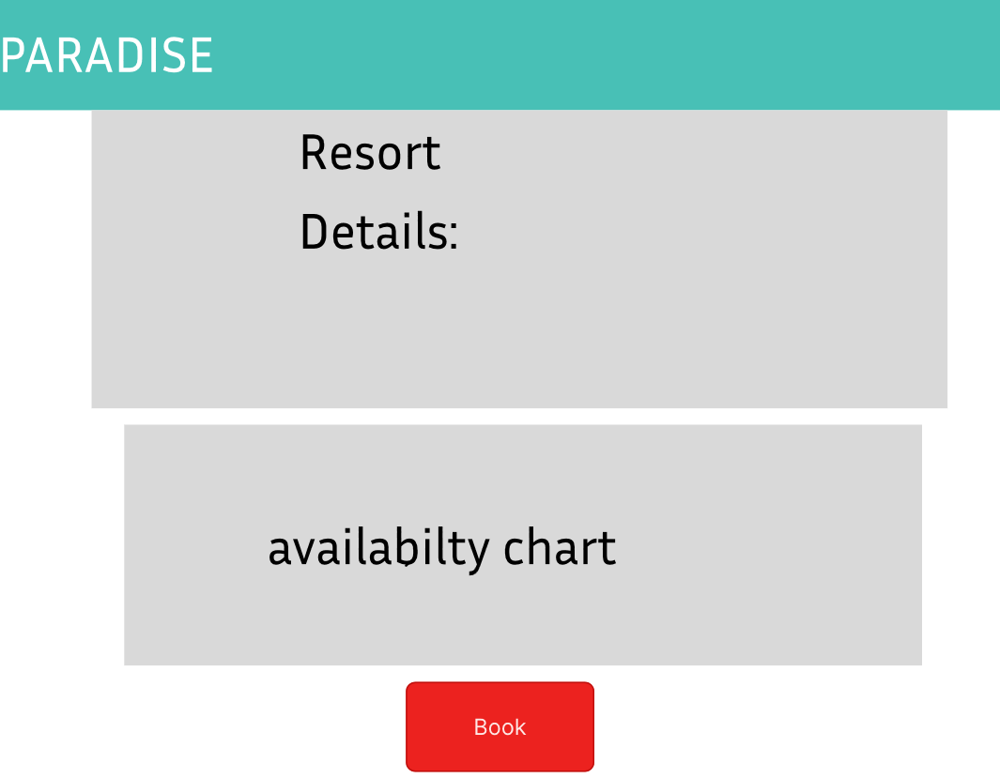

# Resort Booking
## Overview:

This system is for one resort where users can book a stay and admins can manage the resort's details and bookings. The admin controls everything related to the resort, while users can view information, check availability, and make bookings.

## Objectives:

 * **Admin**:
    * Login securely. 
    * Add/update resort details (like name, price, description, etc.). 
    * View and manage user bookings.
  * **Users**: 
    * View resort details (name, price, photos, etc.). 
    * Check availability for specific dates. 
    * Book the resort for their stay. 
    * View and cancel their bookings if needed.
## Workflow:

* **For Users**:
    Home → Resort Details → Check Availability → Make Booking → Confirm User Dashboard → View Bookings → Cancel Booking (if needed)

* **For Admins**:
    Admin Login → Dashboard → Manage Resort → View Bookings → Cancel/Update Bookings

## Pages:

